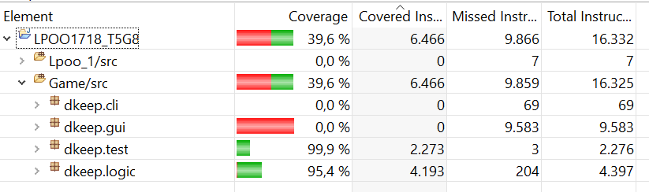

# LPOO1718_T5G8
LPOO projects

[Documentação Javadoc](https://smilingowl.github.io/LPOO1718_T5G8/ "Javadoc")

Catarina de Almeida Figueiredo  up201606334@fe.up.pt

Juliana Maria Cruz Marques up201605568@fe.up.pt
